Last Mile Survey: Rivercess Baseline (2015)
===========================================
*******************************************

Summary of findings - June 19, 2015

Purpose
-------

**ASSESS** the health status of the populations we serve

**GUIDE** the design and prioritization of health care programs

**EVALUATE** the impact of programs conducted by Last Mile Health

Methodology
-----------

**Questionnaire**: based primarily on the standard DHS questionnaire

**mHealth app design**: CommCare app that reflected paper questionnaire and improved data quality and data processing speed 

**Sampling & survey design**: two stage cluster model stratified by distance to clinic and phase 1 and phase 2 intervention districts

**Enumerator selection & training**: 10 Bassa speakers trained in questionnaire, mHealth, biases, probing, etc. 

**Implementation**: late March – April 2015 via 3 data collection teams & one roving supervisor via motorbike and foot in all six districts in Rivercess County

**Data management**: DCT -> central laptop -> CommCare HQ -> usable data files

**Statistical analysis**: use of Stata statistical software with compensation for survey design 

Sampling
--------

- `1,298` women living in `1,376` households were surveyed.
- All `six` health districts were covered.
- `76` different towns and villages were sampled.

Key Notes on Data
-----------------

- Biases: recall bias as predominant bias
- Survey instrument issues: some minor variables missing
- Data quality issues: misinterpretation of a few questions
- Early childhood mortality: pending further validation
- Perspective of enumerators: sometimes seen initially as Ebola workers/counselors
- Questionnaire and indicators slightly different from those of Konobo Baseline: to ensure comparability with DHS, stick to global standards, and collect programmatically relevant data 
- All estimates have a statistical margin of error:  Estimates’ precision are worsened in small subpopulations, so use care when making comparisons.  If you need estimates of statistical uncertainty, talk with an M&E team member - we can provide more detailed analyses.

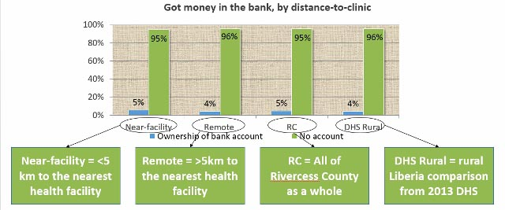

WASH
----

**Drinking Water and Toilet Facility**

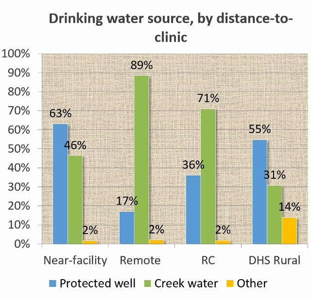

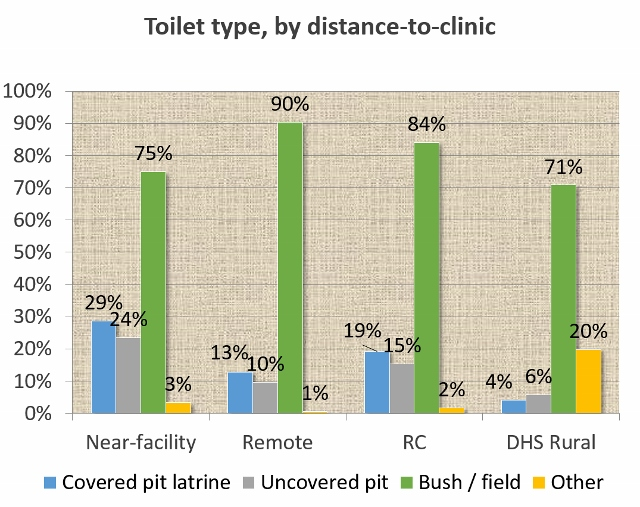

Maternal & Neonatal Health
--------------------------

**Antenatal Care (ANC) visitation**

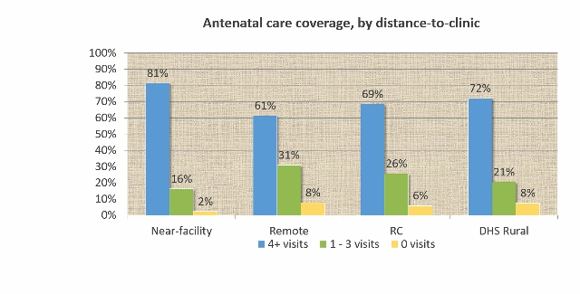

**Antenatal Care (ANC): Care Providers**

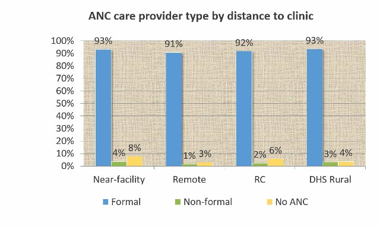

**Facility-Based Delivery**

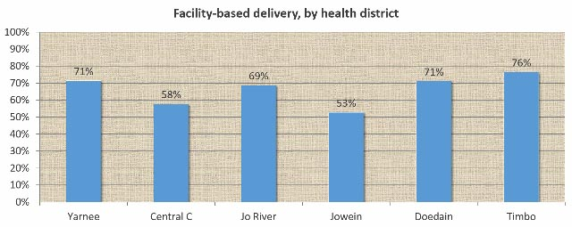

**Maternal Post-Natal Care & Neonatal Care: Receipt of Care**

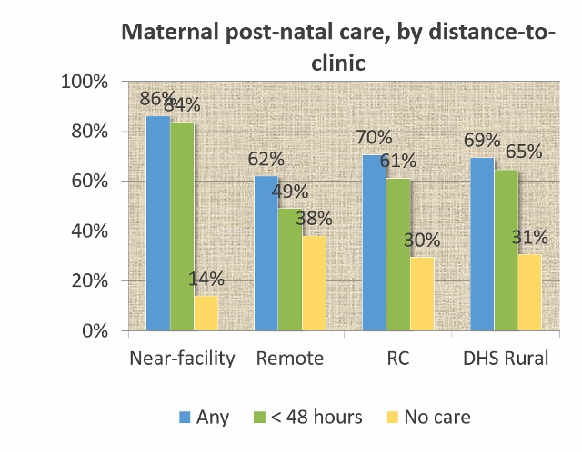

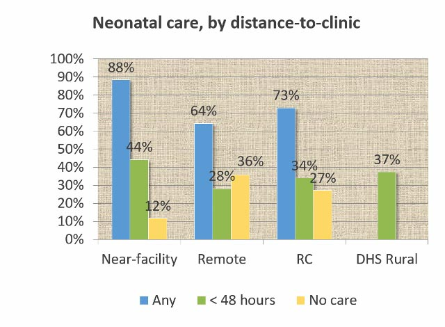

**Receipt of full maternal service cascade**

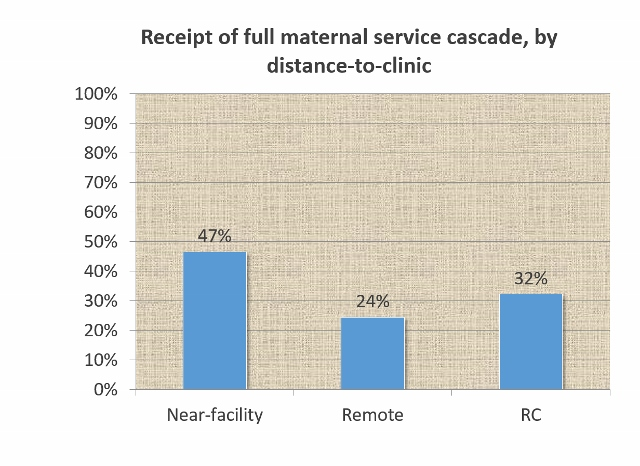

Full maternal service cascade:
- 4 ANC visits
- Facility-based delivery
- Maternal post-natal care by a formal provider

Sexual Health & Family Planning
-------------------------------

**HIV Testing**

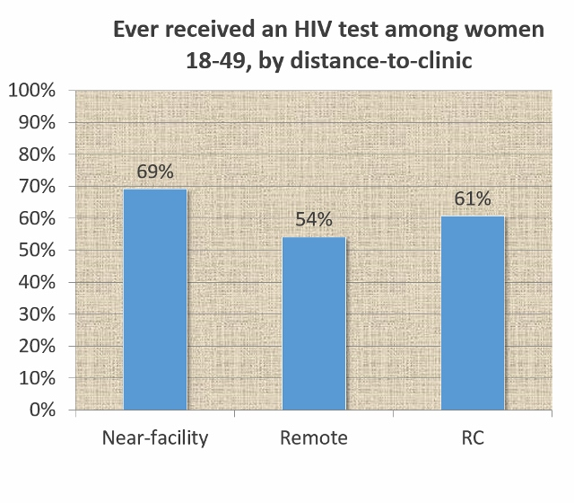

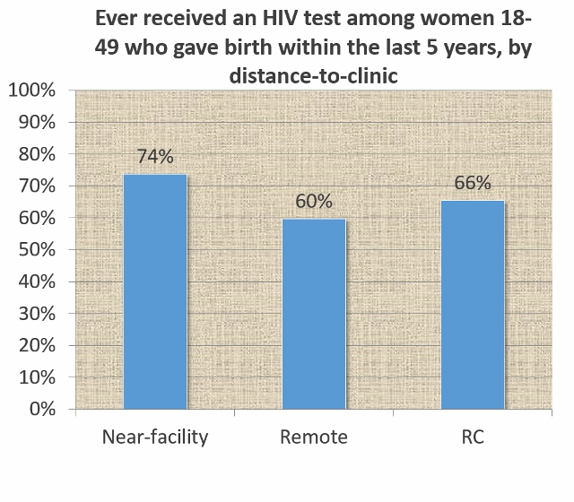

**Family Planning: Current Use of Contraception**

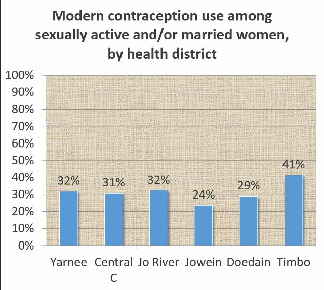

Child Health
------------

**Treatment of Childhood Illness by Formal Provider**

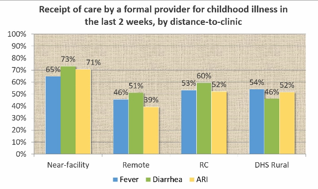

**Vaccination Coverage: Fully Vaccinated**

Vaccinations:
- BCG
- Penta 1-3
- OPV (Oral Polio) 0-3
- Measles
- Yellow Fever
- Pneumo 1-3

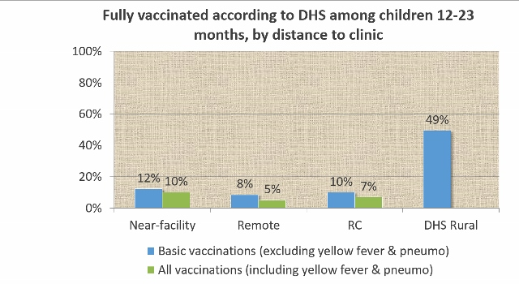

**Vaccination Coverage: By Vaccination**

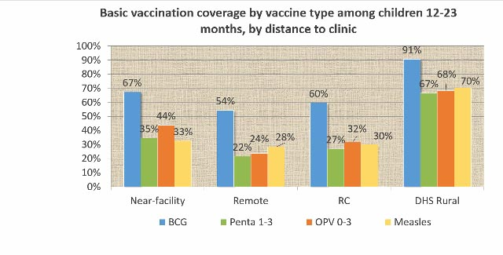

General Health Access
---------------------

**Distance to a Health Facility**

**Acceptable Provider for Medical Care**

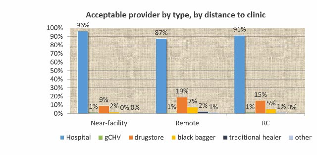

**Barriers to Accessing Health Care**

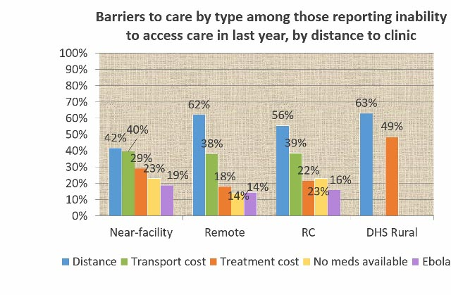

Ebola
-----

**Knowledge of Ebola Signs & Symptoms and Transmission**

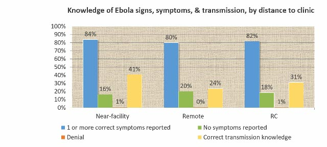
**Anticipated Behavior if Suspected Ebola Case

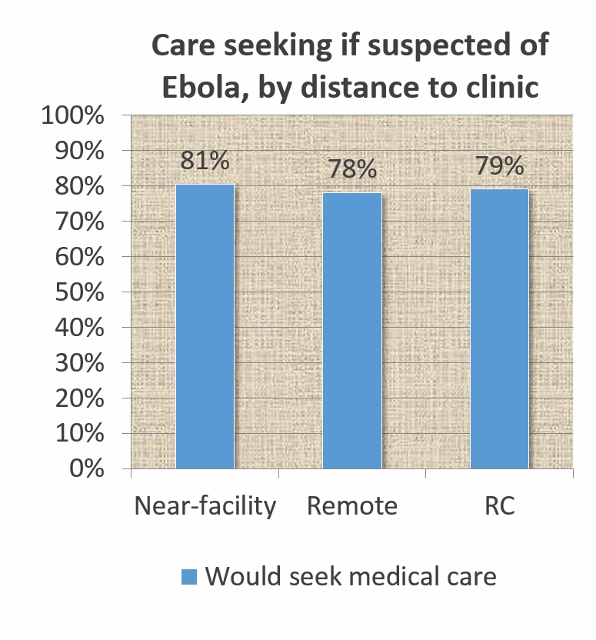

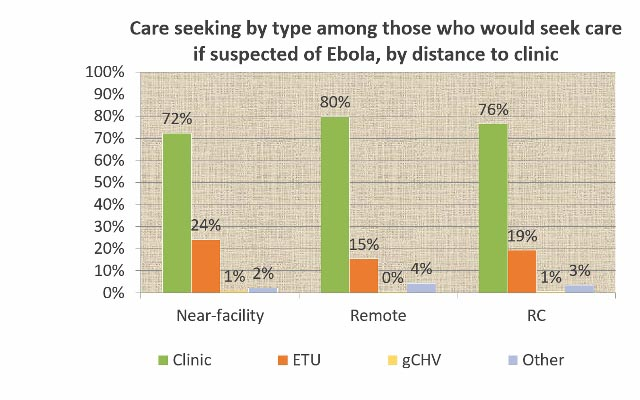

Rivercess Stackup
-----------------

**Rivercess(2015) vs. DHS Rural (2013)**

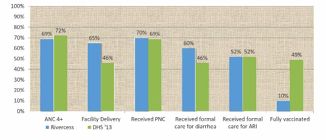

- PNC = maternal post-natal care 
- Received formal care for diarrhea: among children under 5 who had diarrhea in the last 2 weeks, % who received care from a clinic or gCHV
- Received formal care for ARI: among children under 5 who had acute respiratory infection (ARI) in the last 2 weeks, % who received care from a clinic or gCHV
- Fully vaccinated: among children 12-23 months, % who have already received the basic vaccinations (BCG, Penta 1-3, OPV (oral Polio vaccine) 0-3, and measles)

**Rivercess Remove (2015) vs. Konobo (2012)**

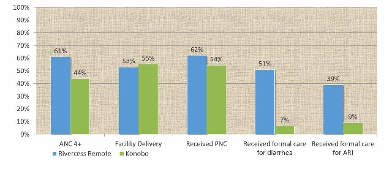

Wrap Up
-------

**Next Steps**

- Further analysis: Further analysis will be conducted jointly with the CHT M&E department and presented jointly
- Full report: September 2015
- Results on Last Mile Data Portal: September 2015
- Further analyses: Complex analysis will be conducted over the coming months on a variety of topics. Suggestions for analysis topics are welcome.
- Gboe-Ploe & Konobo LMS: results in early October
- Early childhood mortality validation: September, following Health Survey analysis
- Follow-up survey: April – May, 2016

**Future Considerations**

- mHealth app switch: moved to ODK which is better for the user and cleaner data management
- Questionnaire improvements: more indicators and comparisons
- Improved training: fewer misinterpretation issues & better data quality
- Impact evaluations: possible after follow-up survey but complicated

**References**

- Bennett, Steve, et al. A Simplified General Method for Cluster-Sample Surveys of Health in Developing Countries. World Health Statistics Quarterly (44). 1991. 
- Leidi, Sandro, et al. STATA 10 for surveys manual. 2008. 
- LISGIS, MOHSW, NACP, ICF International. 2013 Liberia Demographic and Health Survey. 2014.
- MEASURE DHS. 2007 Liberia Demographic and Health Survey. 2008. 
- MEASURE DHS. Sampling Manual. 1996. 
- Rutstein, Shea Oscar, et al. Guide to DHS Statistics. 2006.
- StataCorp. Stata 12 Reference manuals. 2011. 

**Contributors**
- Avi Kenny
- Thomas Griffiths
- Washington Gbowoe
- Joseph Nyumah
- Nicholas Gordon
- Vidiya Sathananthan
- Mark Siedner
- John Kraemer
- Zahir Kanjee
- Gaurab Basu
- Enumerators
- Rivercess Implementation team
- Rivercess County Health Team